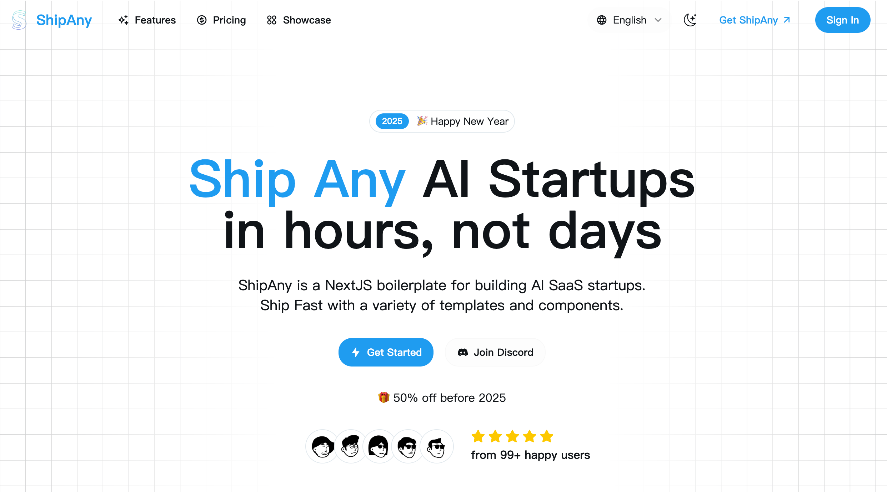

# NanoEdit

Transform Every Photo with AI-Powered Precision

🌐 **Website**: [https://nanoedit.com](https://nanoedit.com)



## 🌟 Overview

NanoEdit is an intuitive AI image editor that blends nano banana ai with Gemini Flash 2.5 to deliver precise edits in seconds. Describe the look you want and watch every photo refresh with pro-level polish.

### Key Features

- 🎨 **Natural Language Editing** - Describe your vision and our AI responds like a professional photo editor
- ⚡ **Lightning Fast** - Get instant results with processing times under 10 seconds
- 🤖 **Multiple AI Models** - Powered by nano banana ai, Gemini Flash 2.5, and proprietary tuning
- 🔧 **Professional Quality** - Agency-grade visuals without complex workflows

## 🚀 What You Can Do

### Core Editing Features
- **Object Removal** - Effortlessly remove unwanted objects or distractions
- **Smart Object Addition** - Add products, people, or props with seamless blending
- **Background Replacement** - Transport subjects to any location or era
- **Style Transfer** - Apply artistic styles with prompt-driven transformations
- **Resolution Enhancement** - 4x upscaling with detail recovery and noise cleanup
- **Color & Light Control** - Advanced adjustments for brand consistency

### Use Cases
- **Photographers** - Professional retouching and enhancement workflows
- **Social Media Managers** - Quick content creation for multiple brands
- **E-commerce** - Product photography without expensive photo shoots
- **Real Estate** - Property staging and lighting improvements
- **Travel Bloggers** - Perfect vacation photos regardless of conditions

## 📊 Platform Stats

- **2.5M+** Images Successfully Processed
- **50K+** Active Creative Professionals
- **8 seconds** Average AI Edit Time

## 🛠️ Quick Start

1. **Upload Your Image**
   - Drag, drop, or paste your source image

2. **Describe Your Edit**
   - Write a plain-language request or detailed prompt

3. **Get Instant Results**
   - AI delivers clean outputs in seconds with smart safety checks

4. **Download & Share**
   - Export versions for clients or store variations for campaigns

## 💡 How It Works

NanoEdit orchestrates advanced AI models to understand your text descriptions and apply sophisticated image editing techniques:

- **Nano Banana AI** - Core intelligence for context understanding
- **Google Gemini Flash 2.5** - Advanced reasoning and precision
- **Proprietary Tuning** - Consistent results across campaigns

## 💰 Pricing Plans

### Starter Plan - $5/month
- 500 credits per month (~50 images)
- Core editing tools
- Standard support (48h response)
- Regular processing queue

### Standard Plan - $10/month ⭐ Most Popular
- 1,100 credits per month (~110 images)
- All trending templates
- Priority processing queue
- Priority support (24h response)
- Enhanced processing speed

### Premium Plan - $20/month
- 2,500 credits per month (~250 images)
- Exclusive premium templates
- Top-priority processing queue
- VIP support (12h response)
- Maximum processing speed
- Beta feature access
- Dedicated account manager

*Annual billing available with 40% savings*

## 🎯 Who Uses NanoEdit

### Professional Testimonials
- **Sarah Mitchell, Professional Photographer**: "What used to take hours in Photoshop now takes seconds. The object removal is incredibly accurate!"
- **Alex Rodriguez, Social Media Manager**: "Creating engaging content for multiple brands is so much easier now."
- **Emily Chen, E-commerce Entrepreneur**: "The background replacement feature is a game-changer for product photos."

## 📋 Technical Specifications

### Supported Formats
- JPG, PNG, WebP, HEIC
- Maximum file size: 5MB
- Maintains original quality in edited results

### Processing Speed
- Most edits: 5-15 seconds
- Complex operations: Up to 30 seconds
- Optimized for speed while maintaining quality

## 🔧 Development Setup

1. **Clone the repository**
```bash
git clone https://github.com/your-username/nanoedit.git
```

2. **Install dependencies**
```bash
pnpm install
```

3. **Set up environment variables**
```bash
cp .env.example .env.development
```

4. **Run the development server**
```bash
pnpm dev
```

## 🌐 Deployment

### Deploy to Vercel
[](https://vercel.com/new/clone?repository-url=https://github.com/your-username/nanoedit)

### Deploy to Cloudflare
```bash
# For new project
git clone -b cloudflare https://github.com/your-username/nanoedit.git

# For existing project
git checkout cloudflare

# Setup environment
cp .env.example .env.production
cp wrangler.toml.example wrangler.toml

# Deploy
npm run cf:deploy
```

## 📚 Documentation

- **Customization**: Edit content in `src/i18n/pages/landing`
- **Theming**: Modify `src/app/theme.css`
- **Internationalization**: Update `src/i18n/messages`

## 🤝 Support & Community

- **Website**: [https://nanoedit.com](https://nanoedit.com)
- **Email**: drewgrant616@gmail.com
- **Documentation**: Full guides and tutorials available

## 📄 FAQ

**Q: Do I need design experience?**
A: Not at all! Describe what you want in plain English and our AI handles the rest.

**Q: What types of edits can I make?**
A: Remove objects, add elements, change backgrounds, modify colors, enhance resolution, apply styles, and much more.

**Q: Is there a free tier?**
A: Yes! New users start with free credits to try all features.

## 📜 License

© 2025 NanoEdit. All rights reserved.

- [Privacy Policy](/privacy-policy)
- [Terms of Service](/terms-of-service)

---

**Transform your images today with AI-powered precision. Join thousands of creators using NanoEdit for instant, professional image editing.**